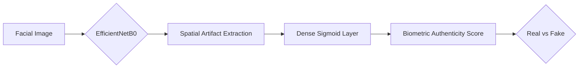
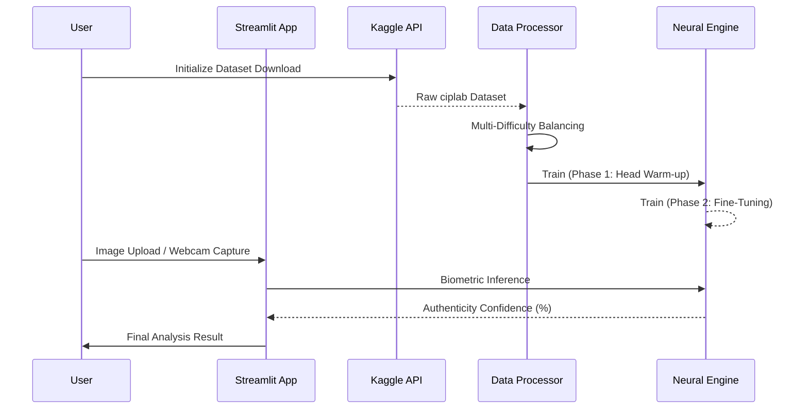

# Deepfake Biometric Analysis System 🛡️

## 🎯 Project Objective
The primary objective of this project is to develop a production-grade Deep Learning pipeline for the detection of AI-generated (Deepfake) facial manipulations. By leveraging compound-scaled neural networks and advanced optimization techniques, the system identifies subtle physiological artifacts that distinguish synthetic imagery from authentic photographs.

## 🖼️ Graphical Abstract



## 🛠️ Tech Stack & Tools

- **Core Framework**: TensorFlow 2.15+ & Keras
- **Architecture**: **EfficientNetB0** (Compound Scaling for High Fidelity)
- **Optimization**: **AdamW** (Decoupled Weight Decay for Stability)
- **Frontend**: Streamlit (High-Performance Biometric Web UI)
- **Image Processing**: OpenCV, Pillow, NumPy
- **Analysis Metrics**: Scikit-Learn (F1-Score, precision-recall Curves)

## 🔄 Project Workflow



## 🚀 Key Features

- **High-Fidelity Feature Extraction**: Optimized 224x224 input resolution to capture microscopic facial artifacts.
- **Biometric Dashboard**: Interactive user interface supporting both static file uploads and live webcam analysis.
- **Multi-Difficulty Robustness**: Trained on a diverse dataset containing "Easy", "Mid", and "Hard" deepfake variants.
- **Production Optimization**: Integrated **AdamW** optimizer and **CosineDecay** learning rate scheduling to ensure model stability and generalization.
- **Detailed Metrics**: Comprehensive evaluation suite providing precision-recall trade-offs and difficulty-based accuracy diagnostics.

## 📂 Project Structure

```text
├── app/
│   └── app.py              # Biometric Analysis Dashboard
├── data/
│   └── ciplab_dataset/     # Extracted Dataset (Kaggle)
├── model/
│   ├── config.py           # Centralized Project Configuration
│   ├── data_loader.py      # Automated Dataset Processor
│   ├── download_data.py    # Automated Kaggle Data Retriever
│   ├── train.py            # Neural Training Pipeline
│   ├── evaluate.py         # Diagnostic Performance Analysis
│   └── saved_models/       # Model Weight Storage (.keras)
├── requirements.txt        # Full Dependency Management
└── readme.md               # Project Documentation
```

## 💻 How to Run Locally

### 1. Environment Setup
Clone the repository and install the production-ready dependencies:
```bash
pip install -r requirements.txt
```

### 2. Data Acquisition
Extract credentials from `kaggle.json` and initialize the dataset:
```bash
python model/download_data.py
python model/data_loader.py
```

### 3. Training & Evaluation
Train the EfficientNetB0 backbone and evaluate against the test set:
```bash
python model/train.py
python model/evaluate.py
```

### 4. Launch Dashboard
Run the biometric dashboard locally:
```bash
streamlit run app/app.py
```

## ☁️ Deployment Guide

The system is architected for easy deployment on **Streamlit Cloud** or **Google Cloud Run**:
1. Push the code and the best-performing model weights in `model/saved_models/` to a GitHub repository.
2. Link the repository to Streamlit Cloud.
3. Configure the `requirements.txt` as the environment specification.
4. Set up `GITHUB_TOKEN` or Kaggle credentials in Secrets if you need automated re-training in the cloud.

---
**Disclaimer**: This project is for analytical and educational purposes. No detection system is 100% accurate; results should be interpreted as biometric confidence scores.
